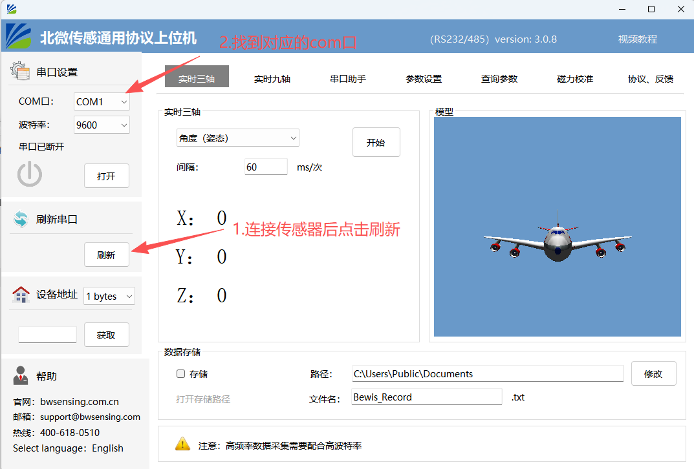
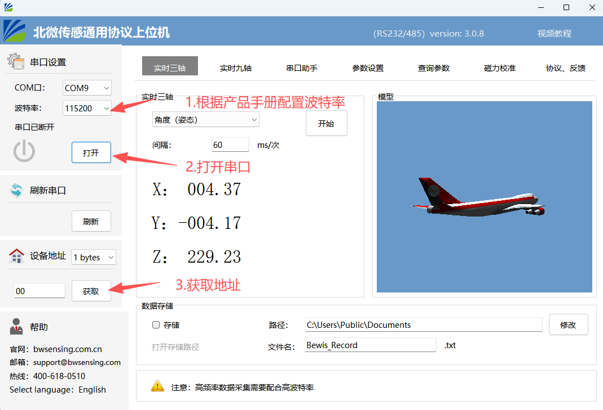
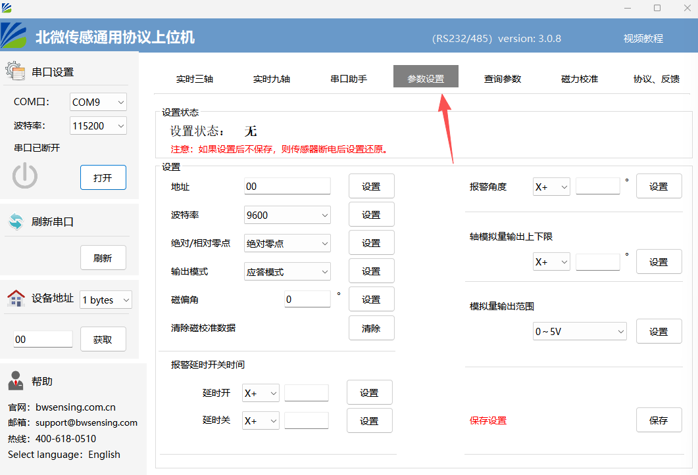
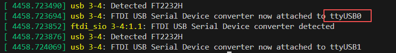
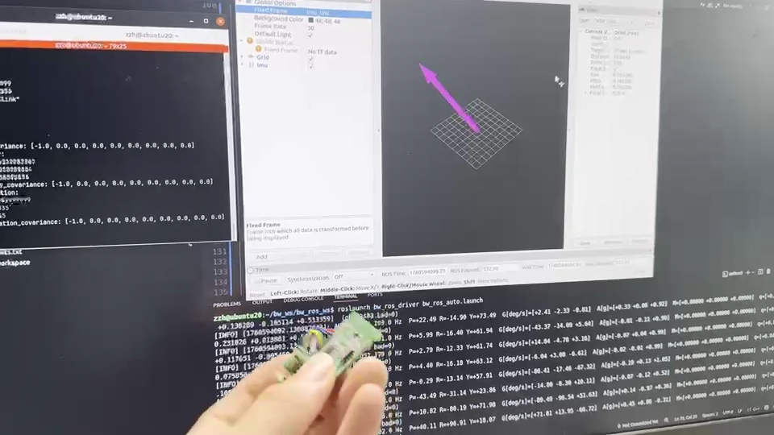

# 1. 功能简介

本ros驱动程序主要实现了以下功能：

- 对北微传感自有产品进行协议解析
- 在ROS系统下快速部署北微传感惯性传感器
- 发布ROS标准消息，方便用户订阅并融合到自有算法中

# 2. 使用方法

## 2.1 在windows中使用上位机配置传感器

1. 将北微产品参考数据手册中的连接方式与PC机进行连接，可在windows中识别到COM口

   

2. 根据我司提供的产品手册，在windows上位机中配置好相关参数

   

3. 点击开始，可以采集到数据且数据无误则传感器配置完成

   

4. 传感器在出厂前已经完成了自动输出的配置，如需更改可在参数设置中配置，配置完之后请保存设置（不建议私自修改参数，部分修改会影响ros驱动）

   

## 2.2在ubuntu系统中配置代码

### 安装ROS

本驱动程序基于ros1(noetic)版本，默认使用ubuntu20.04开发，程序运行需要保证ros已经完成部署，ros的安装教程可以参考ros官方教程：https://wiki.ros.org/noetic/Installation/Ubuntu，此处不过多展开。

### 构建源码

1. 克隆git源码

   ```c
   cd catkin_ws/src
   git clone <https://github.com/zzh-0630/bw_ros_driver.git>
   ```

2. 编译构建本项目

   ```c
   cd ..
   catkin_make
   ```

## 2.3 连接传感器与主机

1. 可以检测到设备插入

   

2. 终端输入命令以显示端口号：`ls -l /dev/ttyUSB*`

3. 给检测到的设备文件号添加权限：`sudo chmod 777 […]`

## 2.4 启动ROS例程

在ros工作空间下输入：

1. `source ./devel/setup.bash`
2. `roslaunch bw_ros_driver bw_ros_auto.launch`


可以看到有调试信息输出

如果想要更直观可以通过rviz显示：

